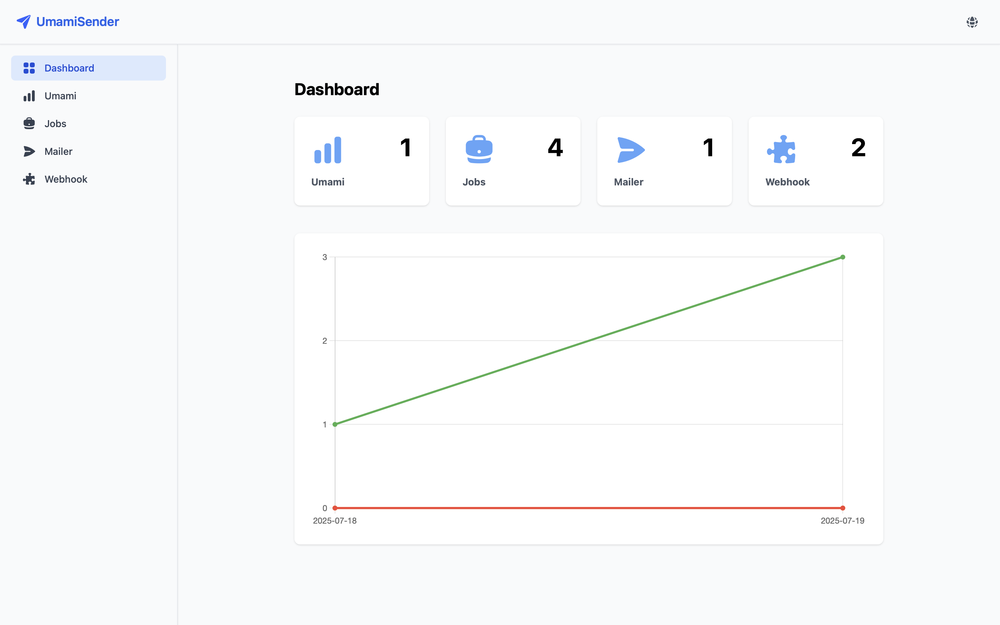
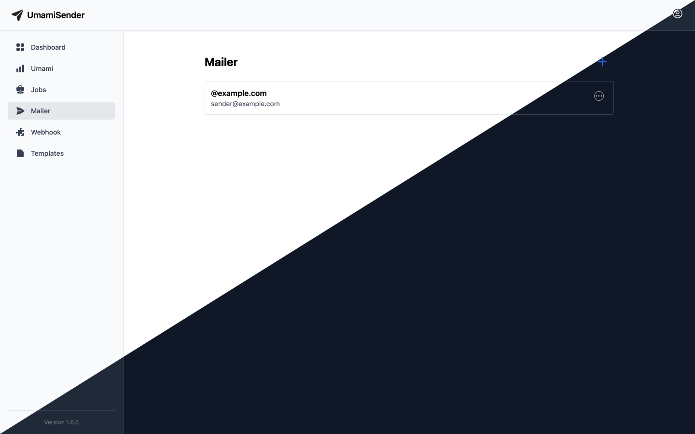

<p align="center">
  
</p>

<h1 align="center">UmamiSender</h1>

<p align="center">
  <i>Automated reports for Umami – via email or webhook, right from your dashboard.</i>
</p>

<p align="center">
  <a href="https://github.com/ceviixx/UmamiSender/releases">
    
  </a>
  <a href="https://github.com/ceviixx/UmamiSender/actions">
    
  </a>
</p>

---

## ✨ What is UmamiSender?

**UmamiSender** is an open-source tool to automatically send scheduled reports from [Umami Analytics](https://umami.is) via email or webhook (e.g. Slack, Discord).  
Perfect for teams, client projects, or personal dashboards.

> Works with both **Umami Cloud** and **Self-Hosted Umami**.

---

## 🧩 Features

- 📈 Automated reporting from Umami
- 📬 Delivery via email or webhook
- 🌐 Supports multiple Umami instances
- 🔗 Webhook integrations (Slack, Discord, etc.)
- 🗓 Scheduling: daily, weekly, or monthly
- 🌍 Multilingual interface (i18n-ready)

---

## 🖼 Screenshots

| Dashboard | Mailer | Webhook |
|----------|---------------|------------------------|
|  |  |  |

---

## ⚙️ System Architecture

```txt
frontend/  # Next.js frontend (user interface)
backend/   # FastAPI REST API
worker/    # Celery worker for background jobs
nginx/     # Reverse proxy for unified access
```

---

## 🚀 Getting Started

### Requirements

- [Docker](https://www.docker.com/) & [Docker Compose](https://docs.docker.com/compose/)
- Optional: Node.js (for local frontend development)

### Start the app

```bash
docker-compose up --build
```

### Available at:

- UI: http://localhost  
- API: http://localhost/api

---

## 🔁 API Routing

Thanks to the built-in NGINX reverse proxy, everything runs on port 80:

| Path      | Destination          |
|-----------|----------------------|
| `/`       | Web UI (Next.js)     |
| `/api/*`  | Backend API (FastAPI)|

👉 In the frontend, make sure to prefix API calls with `/api`:

```ts
// Example API call
const res = await fetch('/api/umami');
```

---

## 🔐 Security

UmamiSender currently **does not include authentication**. All functionality is accessible without login.

### 🔒 Recommendation:

- Use it in **local/private networks** (e.g. home server, Raspberry Pi)
- If exposed publicly: secure via reverse proxy auth (NGINX), VPN, or firewall

---

## 🤝 Contributing

Pull requests, suggestions, and bug reports are very welcome!

### Potential improvements for contributors:

- 🧩 Customizing templates for emails and webhook platforms (e.g. Discord, Microsoft Teams)
- 🔑 Add authentication (e.g. JWT or BasicAuth)
- 📊 Report history & dashboard stats

---

## 💬 Community

Got questions or feedback?  
Join the community on Discord:

<p align="leading">
  <a href="https://discord.gg/tX4XQT7cG7">
    
  </a>
</p>
