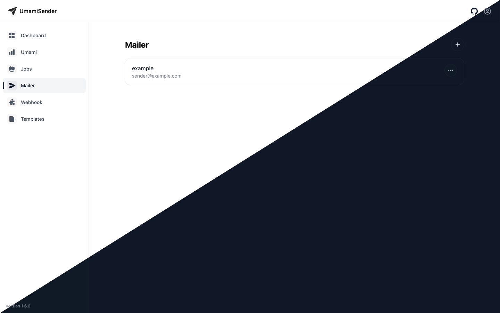

<p align="center">
  <svg width="273px" height="65px" viewBox="0 0 173 25" version="1.1" xmlns="http://www.w3.org/2000/svg">
      <title>umamisender</title>
      <g id="umamisender" stroke="none" stroke-width="1" fill="none" fill-rule="evenodd">
          <path d="M14.917529,25 C15.8241024,25 16.5109106,24.2033074 16.950469,22.9944839 L24.6427269,2.93954814 C24.8624358,2.30770789 25,1.78572232 25,1.34616293 C25,0.494500796 24.5054441,0 23.653615,0 C23.2141973,0 22.6920723,0.137367584 22.0602334,0.357161344 L1.8681443,8.10437798 C0.851660223,8.46153933 0,9.14834911 0,10.0824093 C0,11.2911765 0.906601506,11.6757945 2.08790943,12.0329558 L8.13184445,13.8461348 C9.01096125,14.1208418 9.45051965,14.1483266 9.99996062,13.5988844 L23.0769144,1.42858911 C23.2417664,1.26373676 23.4339062,1.31867817 23.5714704,1.42858911 C23.736041,1.56592856 23.7087532,1.75823755 23.5714704,1.92308991 L11.4560031,15.0823868 C10.9615034,15.6043724 10.9340187,16.016447 11.1812685,16.9230505 L12.9395021,22.7472054 C13.3241193,24.0108859 13.6812517,25 14.917529,25 Z" id="Path" fill-opacity="0.85" fill="currentColor" fill-rule="nonzero"></path>
          <text id="UmamiSender" font-family="Helvetica-Bold, Helvetica" font-size="20" font-weight="bold" fill="currentColor">
              <tspan x="36" y="20">UmamiSender</tspan>
          </text>
      </g>
  </svg>
</p>


<p align="center">
  <i>Automated reports for Umami – via email or webhook, right from your dashboard.</i>
</p>

<p align="center">

  [](https://github.com/ceviixx/umami-sender/releases)
  [](https://github.com/ceviixx/umami-sender/actions)
  
  
  [](https://umami.is)
  

</p>

---

## ✨ What is UmamiSender?

**UmamiSender** is an open-source tool to automatically send scheduled reports from [Umami Analytics](https://umami.is) via email or webhook (e.g. Slack, Discord).
Perfect for teams, client projects, or personal dashboards.

> Works with both **Umami Cloud** and **Self‑Hosted Umami**.

---

## 💎 Why teams love it

* **No more manual check-ins** – get your key metrics delivered automatically.
* **One place to manage everything** – instances, senders, webhooks and scheduled jobs.
* **Shareable by default** – send to multiple recipients or channels at once.

---

## 🧩 Features

* 📈 Automated reporting from Umami
* 📬 Delivery via **email** or **webhook**
* 🧰 Manage **multiple Umami instances** (Cloud & Self‑Hosted)
* 🗓 Scheduling: **daily, weekly, or monthly**
* 👥 **Multiple recipients** per job
* 🌍 **Multilingual interface** (i18n‑ready)
* 🖼 Built‑in **HTML email template** & preview

---

## 🖼 Screenshots

| Dashboard                              | Mailer                              | Webhook                              |
| -------------------------------------- | ----------------------------------- | ------------------------------------ |
|  |  |  |

---

## 🚀 Quick Start

### Requirements

* [Docker](https://www.docker.com/) & [Docker Compose](https://docs.docker.com/compose/)
* Optional: Node.js (for local frontend development)

### Start with GHCR images (recommended)

```bash
docker compose -f docker-compose.ghcr.yml up -d
```

### Start with local build

```bash
docker compose -f docker-compose.build.yml up --build -d
```

### Access

* UI: [http://localhost](http://localhost)
* API: [http://localhost/api](http://localhost/api)

---

## 🔐 Default Login

After starting the app, sign in with:

```txt
Username: admin
Password: sender
```

On first login you will be **prompted to change your password immediately**.
You can also change the **username** later on the **Account** page.

---

## ⚙️ System Architecture

```txt
frontend/  # Next.js frontend (user interface)
backend/   # FastAPI REST API
worker/    # Celery worker for background jobs
nginx/     # Reverse proxy for unified access
```

---

## 🧭 How it works

1. **Add an Umami instance**
   • Cloud: provide your Umami **API key**
   • Self‑Hosted: provide **hostname + credentials** (a bearer token is stored for reuse)

2. **Add recipients**
   • Email sender(s) and/or **webhooks** (Slack, Discord, …)

3. **Create a report job**
   • Choose website, frequency (daily/weekly/monthly), recipients

4. **Done** – UmamiSender will deliver reports on schedule.

---

## 🧪 Try it locally (dev hints)

* Use the provided Compose files to spin up the full stack.
* Most configuration is handled in the **web UI** (instances, senders, webhooks, jobs).
* SMTP settings and webhook URLs are entered when creating senders/webhooks.

---

## 🤝 Contributing

Pull requests, suggestions, and bug reports are very welcome!

**Nice starter ideas:**

* 🎨 Customizable templates for emails and popular webhook platforms
* 🔔 More webhook destinations (Microsoft Teams, Mattermost, …)
* 🌐 Additional languages for the UI

---

## 📄 License

MIT License – free to use in personal and commercial projects.

---

> **Note**: UmamiSender is an independent open‑source project and is not affiliated with [Umami](https://umami.is).
